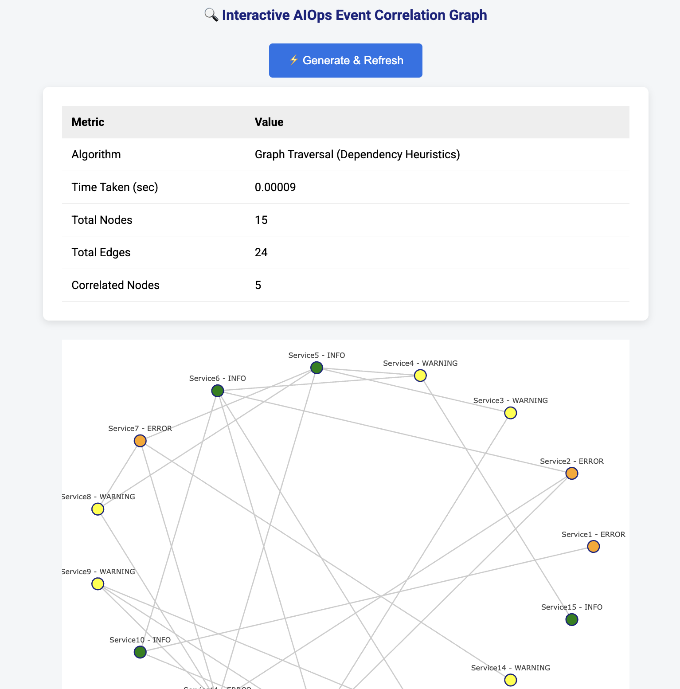

# 🚀 AIOps Event Correlation Dashboard


**Author**: Harshit Pandey  
_Cloud & AI Leader | Infra Solutions_

---

## 📖 Project Overview

This project demonstrates a modern, event-driven **AIOps simulation platform** that mimics how infrastructure alert correlation works in real-world monitoring systems.

### What does this project do?

- It **simulates 200+ events** across a dynamically generated service dependency graph.
- Each event contains attributes like severity, timestamp, source node, and monitoring tool (e.g., CloudWatch, Datadog).
- A **correlation engine** analyzes the graph and **detects root causes** using graph traversal heuristics.
- It generates a **real-time interactive dashboard** where you can view the dependency graph, alert colors, and correlation telemetry.
- You can **refresh the system with 1 click** to simulate new data and track changes.

### What is demoed here?

- Backend: FastAPI for event handling and graph simulation  
- Graph Analysis: NetworkX for modeling service relationships  
- UI: Plotly.js rendered inside an HTML template using FastAPI templating  
- Export: Correlated alerts are saved in JSON and CSV formats  
- Design: Aesthetic layout with Material-style dashboard and badges  

---

## 📁 Folder Structure

```text
aiops-lab/
├── aiops_event_correlation.py     # Core backend application
├── templates/
│   └── graph.html                 # Frontend HTML with Plotly.js
├── static/
│   └── graph.png                  # Saved PNG for fallback
├── static_assets/
│   └── Screenshot.png            # Dashboard screenshot for README
├── alerts.json / alerts.csv       # Exported alert logs
├── requirements.txt               # Python dependencies
└── README.md                      # This file
```

---

## ⚙️ Setup Instructions

### 1. Clone the Repository

```bash
git clone https://github.com/your-username/aiops-event-correlation.git
cd aiops-event-correlation
```

### 2. Create & Activate Virtual Environment

```bash
python3 -m venv venv
source venv/bin/activate
```

### 3. Install Python Dependencies

```bash
pip install -r requirements.txt
```

If `requirements.txt` is missing, use:

```text
fastapi
uvicorn
matplotlib
networkx
jinja2
plotly
```

### 4. Create Required Directories

```bash
mkdir -p static templates static_assets
```

### 5. Add `graph.html` UI Template

Create a file at `templates/graph.html` and paste the full Plotly.js dashboard code into it.

---

## 🚀 Running the Application

```bash
uvicorn aiops_event_correlation:app --reload
```

Then in your browser:

```
http://localhost:8000/run     # To generate data
http://localhost:8000/graph   # To view interactive dashboard
```

---

## 📸 Example Output

Below is a sample graph rendered by the system with severity-coded alerts:

<p align="center">
  
</p>

---

## 📊 Features

- One-click event simulation  
- Graph-based correlation logic  
- Severity-colored interactive network graph  
- Modern telemetry table  
- JSON & CSV alert export  

---

## 📤 Outputs

- `alerts.json`: All alerts grouped by source  
- `alerts.csv`: Flat log format  
- `static/graph.png`: Saved visualization (non-interactive fallback)

---

## 💡 Ideas to Extend

- Add node filters or severity toggles  
- Push to Streamlit, Docker, or Hugging Face  
- Add WebSocket real-time updates  
- Graph export as image or PDF  

---

## 👨‍💻 Author

Harshit Pandey  
LinkedIn: https://linkedin.com/in/harshitpandey

---

## 📄 License

MIT License — use and adapt with attribution.
